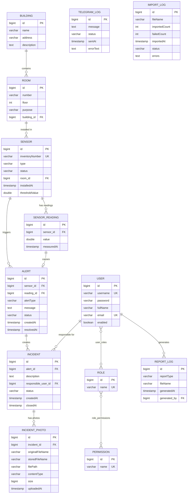

# Логическая схема базы данных

## Описание сущностей и связей

### Основные сущности

| Сущность | Описание |
|----------|----------|
| User | Пользователь системы |
| Role | Роль пользователя |
| Permission | Право доступа |
| Building | Учебный корпус |
| Room | Помещение в корпусе |
| Sensor | Датчик пожарной безопасности |
| SensorReading | Показание датчика |
| Alert | Тревога при превышении порога |
| Incident | Инцидент, связанный с тревогой |
| IncidentPhoto | Фото к инциденту |
| TelegramLog | Лог Telegram-уведомлений |
| ImportLog | Лог импорта CSV |
| ReportLog | Лог формирования отчётов |

### Связи

- **User ↔ Role**: многие-ко-многим (пользователь имеет несколько ролей)
- **Role ↔ Permission**: многие-ко-многим (роль имеет несколько прав)
- **Building → Room**: один-ко-многим (корпус содержит помещения)
- **Room → Sensor**: один-ко-многим (помещение содержит датчики)
- **Sensor → SensorReading**: один-ко-многим (датчик имеет показания)
- **Sensor → Alert**: один-ко-многим (датчик создаёт тревоги)
- **SensorReading → Alert**: один-к-одному (показание вызывает тревогу)
- **Alert → Incident**: один-ко-многим (тревога порождает инцидент)
- **User → Incident**: один-ко-многим (пользователь ответственен за инциденты)
- **Incident → IncidentPhoto**: один-ко-многим (инцидент имеет фото)
- **User → ReportLog**: один-ко-многим (пользователь генерирует отчёты)

## ERD-диаграмма (Mermaid)

## Роли и права доступа

| Роль | Права |
|------|-------|
| ADMIN | Все права |
| DISPATCHER | BUILDING_READ, ROOM_READ, SENSOR_READ, READING_READ, READING_CREATE, ALERT_READ, ALERT_UPDATE, INCIDENT_READ, INCIDENT_UPDATE, REPORT_GENERATE |
| TECHNICIAN | BUILDING_READ, ROOM_READ, SENSOR_READ, READING_READ, ALERT_READ, INCIDENT_READ, INCIDENT_UPDATE, FILE_UPLOAD |
| VIEWER | BUILDING_READ, ROOM_READ, SENSOR_READ, READING_READ, ALERT_READ, INCIDENT_READ |
